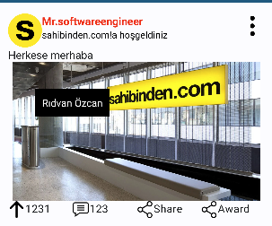

# Compose Baisc Layouts

This repository contains a basic post design layout that I created. You can use this layout as a starting point for your own projects or customize it according to your needs.

## Preview



## Features

- Surface
- Column
- Row
- Image
- Text
- List


## Usage

1. Clone this repository to your local machine:

   ```shell
   git clone https://github.com/ridvanozcan/compose-basic-layouts.git
